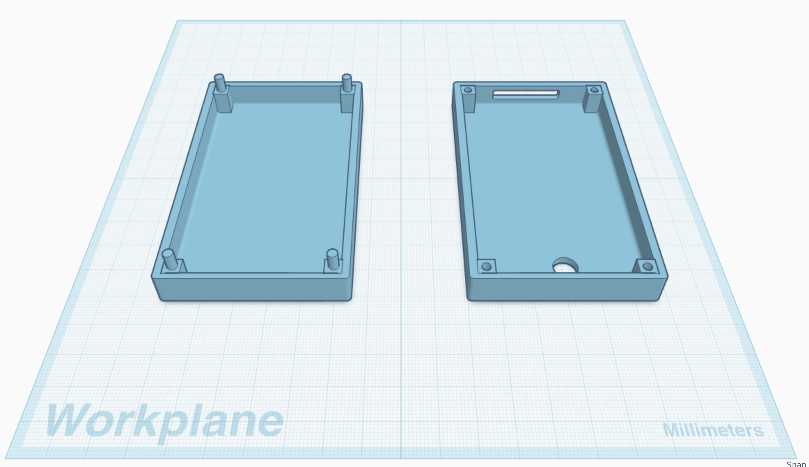
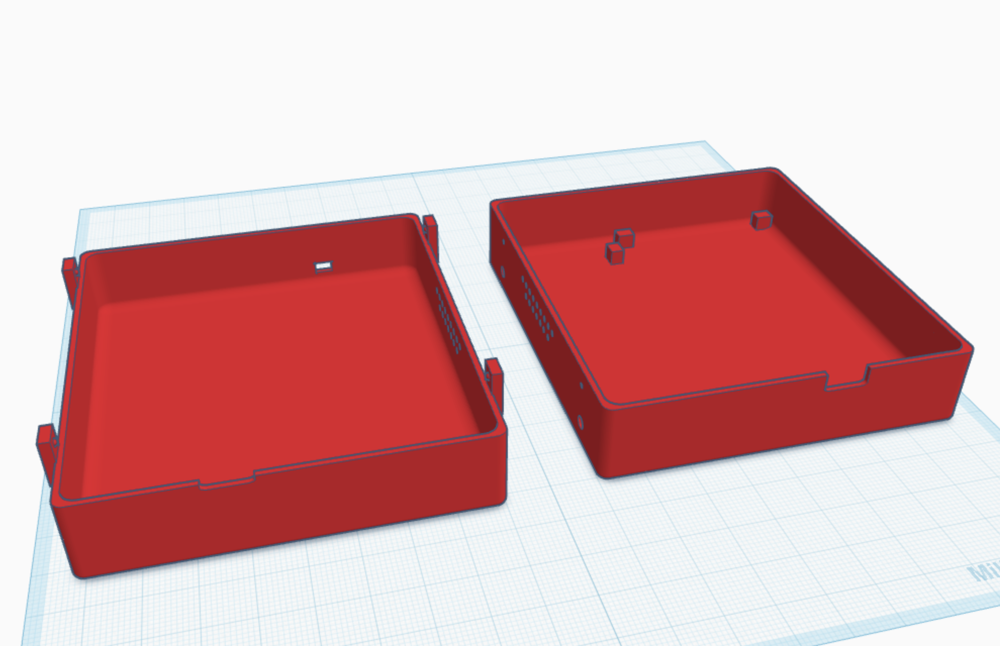

# ESP32 Audio Reminder System
A low-power IoT designed to detect when a dining room light has been left on and provide an audible reminder when the door is opened.

## Overview

The system uses two ESP32 devices communicating over ESP-NOW. A sensor node monitors ambient light levels, while a second ESP32 uses a reed switch to detect door activity and triggers audio playback based on the most recently recieved light reading.

## Circuit Diagrams

The following diagrams illustrate connections and component-level implementation

## Sensor Node

## Door and Audio Node

## Hardware

- Adafruit ESP32 Feather V2 (door node)
- ESP32 DevKitC6 (sensor node)
- Light-dependent resistor (LDR)
- Reed switch
- MAX98357A I2S audio amplifier
- 4Ω speaker
- 10kΩ resistor

## Software

- C/C++ using the Arduino IDE
- ESP-NOW for wireless communication
- I2S for digital audio output
- LittleFS for local audio file storage
- BackgroundAudio to manage WAV file playback

## Firmware

| Component | Description |
|---|---|
| Sensor Node | Reads ambient light levels and transmits sensor data |
| Door/Audio Node | Processes door events, evaluates the latest light reading, and plays audio |

## Future Improvements

- Custom PCB design
- Improved sensor calibration
- Further power optimization and battery implementation
- Dedicated enclosure: I have designed custom 3D printable enclosures for both nodes but have yet to print them

## Mechanical Design

The systems's enclosures were designed in TinkerCAD to explore component placement, physical packaging, and inttegration of the electronic hardware. These designs represent the current mechanical prototypes and have not yet been physically fabricated.

### Sensor Node Enclosure

### Door Node Enclosure

